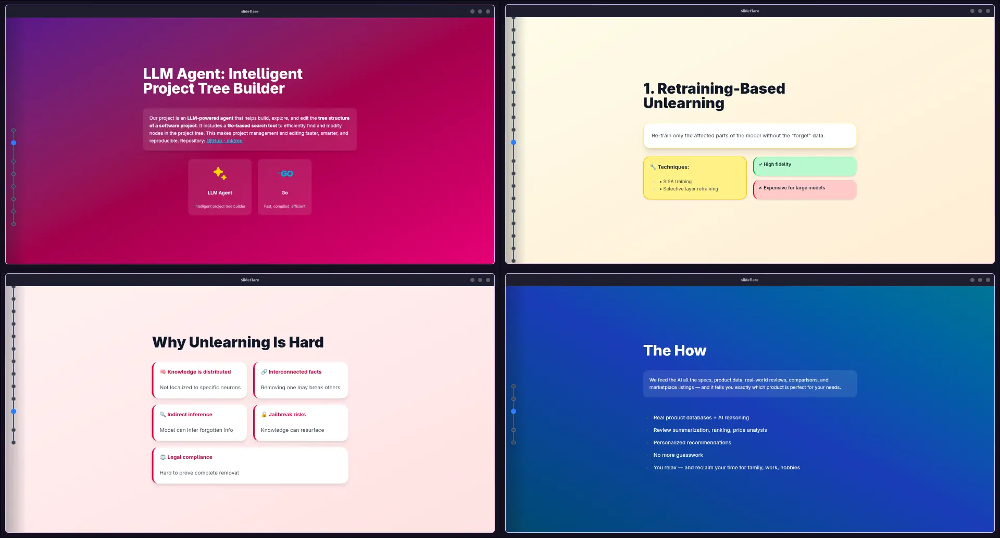

# 🔥 SlideFlare

**From one prompt to a polished presentation. No design skills required.**

[](LICENSE)
[](https://github.com/MeatyAri/slideflare/releases)
[](https://www.rust-lang.org/)
[](https://svelte.dev/)

---

## 🤖 Generate Entire Slide Decks with AI

Stop writing slides. Just **describe them**.

Use the **[slideflare-slides](https://github.com/MeatyAri/slideflare-slides)** skill — a lightweight AI agent that takes plain-language prompts and outputs complete, production-ready slide decks in Markdown:

> `"Create a 12-slide deck on Rust async runtime internals. Cover tokio's executor loop, scheduler design, and include benchmarks comparing blocking vs non-blocking I/O."`

That's it. You get:

- ✅ **Multi-slide decks** — coherent narrative flow, not just bullet points
- ✅ **LaTeX math** — `$E = mc^2$` rendered as MathML, no config needed
- ✅ **Tailwind styling** — gradients, color palettes, responsive layouts — all via utility classes
- ✅ **Images & media** — embedded images, videos with controls
- ✅ **Code blocks** — syntax-highlighted source snippets

Perfect for lightning-fast talks, internal docs, teaching materials, and conference submissions.



```
Describe your deck → slideflare-slides generates the Markdown → open in SlideFlare → present
```

---

## ✨ Features

- **Markdown-native** — Write slides with YAML frontmatter. GitHub Flavored Markdown + syntax highlighting.
- **LaTeX math** — Inline and display math rendered to MathML via [pulldown-latex](https://github.com/raphlinus/pulldown-latex).
- **Rich media** — Images (PNG, JPG, GIF, SVG, WebP), videos (MP4, WebM, AVI, MOV, OGV).
- **Tailwind CSS** — Full Tailwind utility class support for backgrounds, colors, and layouts.
- **Rust-powered** — Lightning-fast parsing, caching, and hot-reloading via Tauri 2.0.
- **Drag & drop** — Drop `.md` files onto the app to launch presentations instantly.
- **Cross-platform** — Windows, macOS, Linux.

## 🚀 Quick Start

Write your slides in Markdown, separate with `---`:

```markdown
---
bg_color: bg-gradient-to-br from-blue-600 to-purple-700
text_color: text-white
title: Welcome!
---

# Hello World 🌍

Built with **Markdown**, styled with Tailwind, equations rendered as MathML.

---

## The Quadratic Formula

$$x = \frac{-b \pm \sqrt{b^2 - 4ac}}{2a}$$

That's it.
```

Open SlideFlare and **drag and drop** your `.md` file — or double-click a slide file to launch it directly.

## 🎯 Examples

A full 15-slide walkthrough covering every feature: [intro-to-slideflare.md](examples/intro-to-slideflare.md)

## 📥 Installation

Download from [GitHub Releases](https://github.com/MeatyAri/slideflare/releases):

| Platform | File                             |
| -------- | -------------------------------- |
| Linux    | `slideflare-linux-x64`           |
| macOS    | `slideflare-macos-universal.dmg` |
| Windows  | `slideflare-windows-x64.exe`     |

### Arch Linux (AUR)

Install the stable release or latest git version with [paru](https://github.com/Morganamilo/paru):

```bash
paru -S slideflare        # Stable release
paru -S slideflare-git    # Latest git HEAD
```

### Linux & macOS

**Linux & macOS (binary):**

```bash
chmod +x slideflare && ./slideflare
```

**Windows:** Double-click the executable.

### Build from Source

Requires Rust (latest stable), Bun or Node.js 18+, and [Tauri prerequisites](https://v2.tauri.app/start/prerequisites/).

```bash
git clone https://github.com/MeatyAri/slideflare.git && cd slideflare
bun install
bun run tauri build
```

## 🛠️ Development

| Command               | Description                      |
| --------------------- | -------------------------------- |
| `bun run tauri dev`   | Start dev server with hot reload |
| `bun run check`       | TypeScript type checking         |
| `bun run lint`        | ESLint + Prettier                |
| `bun run tauri build` | Production binary                |

## 📝 Contributing

We welcome contributions! Here's how:

1. **🐛** Report bugs via [GitHub Issues](https://github.com/MeatyAri/slideflare/issues)
2. **💡** Suggest features and improvements
3. **📝** Improve documentation
4. **🔧** Submit pull requests

Please review our contributing guidelines and code of conduct before contributing.

## 🔮 Roadmap

### 0.2.0

- [ ] AI-powered slide conversion (PowerPoint / PDF)
- [ ] Mermaid diagram support
- [ ] Shiki Magic Move for animated code transitions
- [ ] Custom themes via JSON config

### 0.3.0

- [ ] Multipart slides for complex layouts
- [ ] Parallel processing optimizations
- [ ] PDF export
- [ ] Online sharing with generated links

### Future

- [ ] Real-time collaborative editing
- [ ] Plugin system
- [ ] Mobile presentation controller
- [ ] Cloud synchronization

## 📜 License

This project is licensed under the **Apache 2.0 License**. See [LICENSE](LICENSE) for details.

---

**Made with ❤️ and ☕ by [Meatyari](https://github.com/MeatyAri)**

_Star ⭐ this repo if you find SlideFlare useful!_
