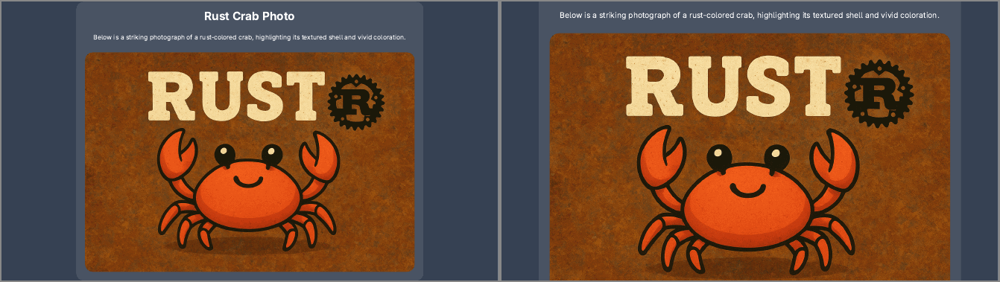

# Headless export — what is possible, and what landed

Status: all three platforms are implemented; **only Linux/BSD is verified.**

- **Linux/BSD** — landed and measured pixel-for-pixel against `main` (7c4255c).
- **Windows and macOS** — implemented, compiled by CI, and **never run by hand
  by anyone**. No machine was available for either. They are guarded by the
  fidelity gate described under "Verification", which renders every deck twice
  on the CI runner and requires the two to be identical; until that gate has
  gone green on a real run, treat both as unproven.

Everything under "Evidence" was measured on one machine: Arch, Wayland session,
WebKitGTK 2.52.5, GTK 3.24.52, GTK 4.22.4.

## The question

`slideflare export pdf` used to boot the full app, create a real toplevel window,
move it to `(-10000, -10000)`, and print the live webview. Could it instead
render with no window at all, the way `chromium --headless` does?

Two different things get called "headless", and they have different answers:

1. **No window** — nothing is ever mapped on the compositor, nothing flashes on
   screen, no offscreen-coordinate trick, no Wayland caveat.
2. **No display server** — the binary runs over SSH or in a bare container with
   no `DISPLAY`, no `WAYLAND_DISPLAY`, no `xvfb`.

## Verdict

|                           | Linux/BSD                                         | Windows                                      | macOS                                        |
| ------------------------- | ------------------------------------------------- | -------------------------------------------- | -------------------------------------------- |
| Nothing visible on screen | **Done — output identical to the windowed build** | Implemented, unverified                      | Implemented, unverified                      |
| No window object at all   | **Done**                                          | HWND exists, never shown                     | Impossible — the window must stay ordered in |
| No display server         | **Impossible** with WebKitGTK                     | Needs a window station (interactive session) | Needs an Aqua session                        |

The short version: **(1) is achievable and has landed on GTK; (2) is not
achievable with system webviews and should be dropped as a goal.** The system
webview _is_ the renderer, and on every platform it is a UI-toolkit widget whose
existence requires a display connection. Chromium can go display-free because it
ships its own rasteriser and a headless platform layer; WebKitGTK, WKWebView and
WebView2 do not expose one.

## Evidence

### Linux: a display connection is mandatory

```
$ env -u DISPLAY -u WAYLAND_DISPLAY ./hlprobe offscreen
PROBE gtk_init: FAIL Failed to initialize GTK
```

Bypassing the Rust binding's `assert_initialized_main_thread!` and calling the C
API directly does not help — it crashes rather than degrading:

```
$ env -u DISPLAY -u WAYLAND_DISPLAY ./raw
RAW gtk_init_check -> 0
RAW creating webview...
(raw): Gtk-CRITICAL: _gtk_style_provider_private_get_settings: assertion failed
Segmentation fault (core dumped)
```

GTK 3 has no headless GDK backend. `GDK_BACKEND=broadway` is compiled into
`libgtk-3.so.0` here but needs a running `broadwayd`, so it is not display-free
either. GTK 4.22's `libgtk-4.so.1` exports only `gdk_x11_display_open` and
`_gdk_wayland_display_open` — no headless backend there either, so moving to
`webkitgtk-6.0` would not change the answer.

### Linux: a _window_ is not needed at all

A `WebKitWebView` that was **never added to any container, never realized, never
mapped** prints a correct PDF:

```
$ ./hlprobe orphan
PROBE gtk_init: OK
PROBE load: finished
PROBE print: FINISHED
$ pdfinfo probe.pdf
Pages: 2        Page size: 960 x 540 pts
$ pdftotext probe.pdf -
HEADLESS PROBE √ page one
two
```

Two pages from a `page-break-before`, exact 960x540 paper, selectable text — real
vector output through the normal GTK print path, with no window. The producer
string is `Skia/PDF m145`, so WebKitGTK 2.52 paginates through Skia and does not
consult the compositor at all.

This contradicts the note that stood in `docs/testing-platform-exports.md`: an
unrealized widget prints fine. What is unsafe is something else.

### Linux: the _container_ decides what the web content sees

Same probe, measuring what JavaScript observes, across four container shapes:

| container                          | `innerWidth x innerHeight` | `visibilityState` | rAF in 3s | layout reads |
| ---------------------------------- | -------------------------- | ----------------- | --------- | ------------ |
| `GtkOffscreenWindow`, shown        | `1280x720`                 | `visible`         | **3**     | ok           |
| toplevel, realized, never mapped   | `1280x720`                 | `hidden`          | **0**     | ok           |
| orphan widget + `set_size_request` | `0x0`                      | `hidden`          | **0**     | ok           |
| orphan widget                      | `0x0`                      | `hidden`          | **0**     | ok           |

`document.fonts.ready` resolved and `offsetHeight` was correct in every case, so
fonts and synchronous layout are safe everywhere. Animation frames and the
viewport size are not.

`GtkOffscreenWindow` is the outlier that matters: the only shape where the web
content believes it is a normal visible 1280x720 page, while nothing reaches the
compositor.

### Why `visible: false` on its own is a trap

Hiding the toplevel and changing nothing else exits `0` and produces a
plausible-looking 7-page PDF that is silently wrong: slides that should have been
shrunk to fit are rendered at full size and clipped by the page.



_Left: the windowed build. Right: the same slide with the window hidden — the
deck failed to shrink it, so the title is cut off and the image runs off the
page._

Root cause is the deck's self-measurement. `Slide.svelte` reports its natural
content height with `bind:clientHeight`; `+page.svelte` derives one `fitScale`
for the whole deck from those heights. Two follow-up experiments narrowed it:

- Polling `article.clientHeight` every 50ms instead of relying on the
  `ResizeObserver` behind `bind:clientHeight` — **no change**. Observer delivery
  is not the bottleneck.
- Additionally awaiting `HTMLImageElement.decode()` on every image before
  declaring readiness — **six of seven pages became pixel-identical**. So the
  under-measurement is images not having settled, not observers not firing.
- The one page still wrong was the `<video>` slide (`examples/example.md:103`),
  which has no equivalent of `decode()` in the readiness path.

This is the class of failure `docs/testing-platform-exports.md` calls the
dangerous one — success exit code, wrong file — and it is why the implementation
uses a container the engine keeps rendering rather than one that merely hides.

## What landed

The main window is now declared `"visible": false` in `tauri.conf.json` and
shown explicitly by presentation mode, so export mode never maps it at all — not
even for the frame it would take to move or hide it again. From there each
platform does whatever makes its engine call the content visible. All three are
reached from `cli::gui::configure_export_window`.

### Linux/BSD — `render_offscreen`

Behind a `gtk_platform` cfg that `build.rs` sets from the same target list
Cargo.toml gates `webkit2gtk`/`gtk`/`glib` on:

1. `window.hide()` — the toplevel stays, unmapped and empty, because Tauri's
   window bookkeeping and the `RunEvent::Exit` guard in `run_app` key off it.
2. Through `with_webview`, remove the `WebKitWebView` from its GTK parent.
3. Add it to a `GtkOffscreenWindow` sized `EXPORT_WIDTH`x`EXPORT_HEIGHT` and
   `show_all()` it — that realizes and allocates it, which is what gives the page
   its viewport.
4. Park the offscreen window in a `thread_local`, since it now owns the webview.

There is no window on the compositor and no position to set, so `OFFSCREEN` and
`set_position` are not used here.

### Windows — `render_hidden`

The HWND is never shown. That alone would produce exactly the silent mis-scale
described above, because WebView2 derives the page's `visibilityState` — and
with it the compositor, animation frames, and whether images settle their layout
box — from `ICoreWebView2Controller::IsVisible`, which wry sets from the window's
own visibility when it creates the webview. So the controller is told the
opposite of the window, through `with_webview`:

```rust
platform.controller().SetIsVisible(true)
```

That pairing is what WebView2 documents as the way to keep a webview live in a
window that is not on screen: hiding the HWND is explicitly _not_ what releases
the renderer's resources, `IsVisible` is. `ICoreWebView2_7::PrintToPdf` is a
browser-level call and needs no window either way. If the call fails, the
previous shape — a realized, undecorated window parked at `(-10000, -10000)` —
is restored rather than risking a plausible-looking wrong PDF.

### macOS — `render_unoccluded`

macOS is the one platform that cannot be given a hidden or detached surface. A
`WKWebView` in a window that was never ordered in is not merely invisible, it is
_suspended_: AppKit reports the window as occluded, WebKit drops the web content
process out of its visible activity state, and the print then waits forever for
pages that are never drawn. That is not a prediction — it is how the earlier
offscreen attempt presented, and why macOS used to be left with a centred,
visible window. `NSPrintOperation` also insists on a real `NSWindow` for its
(suppressed) sheet, so `-[WKWebView window]` has to keep returning one.

The way out is to take away the signal rather than the window:

1. Make the window borderless. AppKit constrains a _titled_ window's frame to
   keep its title bar reachable, which would clamp the move back onto a screen;
   a borderless window is not constrained.
2. `-[NSApplication _setWindowOcclusionDetectionEnabled:]` with `NO`, so
   `-[NSWindow occlusionState]` reports every window visible.
3. Move it to `(-10000, -10000)` and order it in.

Step 2 is private API. It is probed with `respondsToSelector:` first, and if it
is missing the window simply stays where `tauri.conf.json` centres it and is
visible for the few seconds a render takes — the old behaviour, which works.
Flag it if the app is ever submitted to the App Store.

### The escape hatch

`SLIDEFLARE_EXPORT_WINDOW=visible` puts the old realized window back on every
platform (`render_in_a_window`). Two jobs, both load-bearing:

- Anyone whose runtime gets the visibility contract wrong can recover without
  downgrading. This matters because the failure mode is a _plausible_ PDF rather
  than an error.
- It is the reference the CI fidelity gate compares against. See below.

### Frontend

Two changes, both safety nets rather than fixes for anything Linux needed:

- `waitForDeckReady` now awaits `HTMLImageElement.decode()` on every image before
  it trusts the measurements, then waits for the reported slide heights to stop
  changing across two polls. Images not having settled is the _mechanism_ behind
  every mis-scaled deck seen here, so this is the check that makes the failure
  mode impossible rather than merely unlikely.
- `nextFrames()` in `src/lib/export/export.svelte.ts` gained the same 1s cap its
  twin in `+page.svelte` already had. Without it, a webview that stops delivering
  animation frames hangs the export before `export_pdf` is ever invoked.

Video is deliberately **not** waited on — see "Known difference" below.

## Verification

### Linux — measured against `main`

Reference is a binary built from `main` at 7c4255c on the same machine, with the
same frontend build. `pdftoppm` at the stated resolution, then
`magick compare -metric AE` per page; `AE` is the count of differing pixels, so
`0` is exact.

| check                                                                      | result                           |
| -------------------------------------------------------------------------- | -------------------------------- |
| `main` vs `main`, `example.md` (determinism of the baseline itself)        | 7/7 pages `AE=0` @150dpi         |
| `main` vs windowless, `example.md`                                         | **7/7 pages `AE=0` @150dpi**     |
| `main` vs windowless, `example.md`                                         | **7/7 pages `AE=0` @300dpi**     |
| `main` vs windowless, `intro-to-slideflare.md`                             | **12/12 pages `AE=0` @150dpi**   |
| windowless vs windowless (reproducibility)                                 | 7/7 pages `AE=0` @150dpi         |
| windowless vs `SLIDEFLARE_EXPORT_WINDOW=visible`, `intro-to-slideflare.md` | 12/12 pages `AE=0` @150dpi       |
| `main` vs windowless, `export html`                                        | **byte-identical** (`cmp` clean) |

Contracts and checks that also still hold: `cargo fmt --check`, `cargo clippy
--all-targets -- -D warnings`, `cargo test`, `bun run check` (0 errors), and
presentation mode still opening a normal window.

### Windows and macOS — the CI fidelity gate

Neither could be built here, let alone run: this machine has no MSVC toolchain,
no macOS SDK, and no cross C compiler, so `cargo check --target` fails in a build
script for both. Every claim about those two paths is reasoned from the platform
contracts above and is worth exactly what CI says it is worth.

So `export-smoke` in `.github/workflows/ci.yml` gained a gate that can fail them.
Everything else in that job passes for a deck that rendered _wrongly_ — the
failure mode is a right page count, a right page size, a plausible file size and
exit code 0. The gate instead renders `examples/intro-to-slideflare.md` twice on
the same runner:

```
slideflare export pdf ... -o fidelity-windowless.pdf
SLIDEFLARE_EXPORT_WINDOW=visible slideflare export pdf ... -o fidelity-windowed.pdf
python scripts/pdf-pixel-diff.py fidelity-windowless.pdf fidelity-windowed.pdf --dpi 150
```

and requires them to rasterize identically. A reference produced by the same
engine, the same fonts and the same machine is the only one worth having here; a
committed PNG could not be, because text rasterizes differently on every platform
and on any two runner images. On failure the first differing page is uploaded as
an artifact.

**That comparison alone would be worthless**, and this is the part worth reading
twice. Every windowless path falls back to the old visible window when the
platform will not cooperate — Windows if `SetIsVisible` fails, macOS if the
occlusion selector is missing. A fallback that engaged silently would leave both
sides of the comparison as the _same_ windowed render: identical pixels, perfect
agreement, nothing tested. So every export prints the path it actually took:

```
slideflare: export render mode: gtk-offscreen
```

and CI requires the exact token for the platform it is on — `gtk-offscreen`,
`webview2-hidden` or `appkit-unoccluded` for the windowless run, `visible-window`
for the reference — before it compares anything. A fallback now fails the job
instead of passing it quietly. The negative case was exercised by forcing the
fallback locally: the step fails with
`the windowless render fell back to 'visible-window'` while the two PDFs are
byte-for-byte the same.

macOS reports `visible-window` rather than `appkit-unoccluded` when
`respondsToSelector:` says the occlusion switch is gone, because without it the
path _is_ the old behaviour under a new name, and CI should not accept it as a
win.

`scripts/pdf-pixel-diff.py` uses `pypdfium2` and `pillow` — pip wheels with the
renderer inside them, so setup is the same two lines on all three runners, which
`pdftoppm` and `magick` would not be.

### Known difference: `<video>`

`examples/example.md` has a `<video>` with a real file behind it, and the two
modes do **not** agree on it:

- Windowless (GTK): the offscreen window never starts a media pipeline, so the
  element never reports metadata, and it is laid out collapsed.
- `SLIDEFLARE_EXPORT_WINDOW=visible`: metadata arrives during the readiness wait
  and the element is laid out at its full size.

`main` printed it collapsed too, but only by winning a race — it reached the
print before metadata arrived. The windowless path does not race; it deterministically
never gets metadata. Either way the deck matches `main` byte for byte on this
machine, which is why this is recorded rather than fixed here. The readiness
check deliberately does not wait on `loadedmetadata`: it would only add the
10s cap to every export with a video in it, on the one platform where the event
never comes. `intro-to-slideflare.md` is the fidelity deck precisely because its
video source does not resolve, so both modes collapse it identically. Tracked in
`TODO.md`.

## Still to do

- **Watch the first green run of the fidelity gate on Windows and macOS.** Until
  then the two paths are untested code, and the sentences above describing what
  WebView2 and AppKit do are citations, not measurements. The gate cannot be
  passed by a fallback, so green means the intended path ran.
- **Render `<video>` in the windowless GTK export**, or decide deliberately that
  a printed deck shows a poster frame and make that explicit rather than
  emergent.
- **`xvfb-run` stays on Linux.** This removes the window, not the display
  requirement.

## Rejected alternatives

- **Bare wry / bare WebKitGTK for export, skipping Tauri.** wry can build a
  webview into any GTK container (`build_gtk`), so the rendering half is easy.
  The rest is not: the deck reaches its content through Tauri's invoke and asset
  protocols, so this means reimplementing IPC and ending up with the parallel,
  drifting code path the CLI was designed to avoid.
- **Drive a headless Chromium over CDP.** Genuinely display-free and
  cross-platform, but it adds an external runtime dependency and a _second
  renderer_, so PDF output would no longer match what the user sees in the app.
  Worth revisiting only if a server-side render service becomes a product goal,
  and then as an explicitly separate `--renderer` backend.
- **WPE WebKit.** Designed for exactly this (embedded/headless, no X or Wayland)
  and the same engine, so fidelity would hold. There is no maintained Rust
  binding and no wry support; it would mean owning the bindings. Research note,
  not a plan.
- **Auto-spawning `Xvfb`/`cage`/`weston --backend=headless` when `DISPLAY` is
  unset.** Cheap, and it does make `slideflare export` work over SSH. It is not
  headless rendering, it is a virtual display, and it adds a dependency-detection
  path. Reasonable as a separate convenience; the honest alternative is a clear
  error naming `xvfb-run`.

## Reproducing the comparison

The same check CI runs, locally, on any platform:

```
bun run build
cd src-tauri && cargo build --release --features custom-protocol
target/release/slideflare export pdf ../examples/intro-to-slideflare.md -o a.pdf
SLIDEFLARE_EXPORT_WINDOW=visible \
  target/release/slideflare export pdf ../examples/intro-to-slideflare.md -o b.pdf
pip install pypdfium2 pillow
python ../scripts/pdf-pixel-diff.py a.pdf b.pdf --dpi 150
```

To compare against another commit instead, build a binary from it and diff the
two the same way.

Note the ordering: `frontendDist` is embedded at _Rust_ compile time, so a
frontend-only rebuild changes nothing until `cargo build` runs again. That cost
one round of confusing results during this spike.
